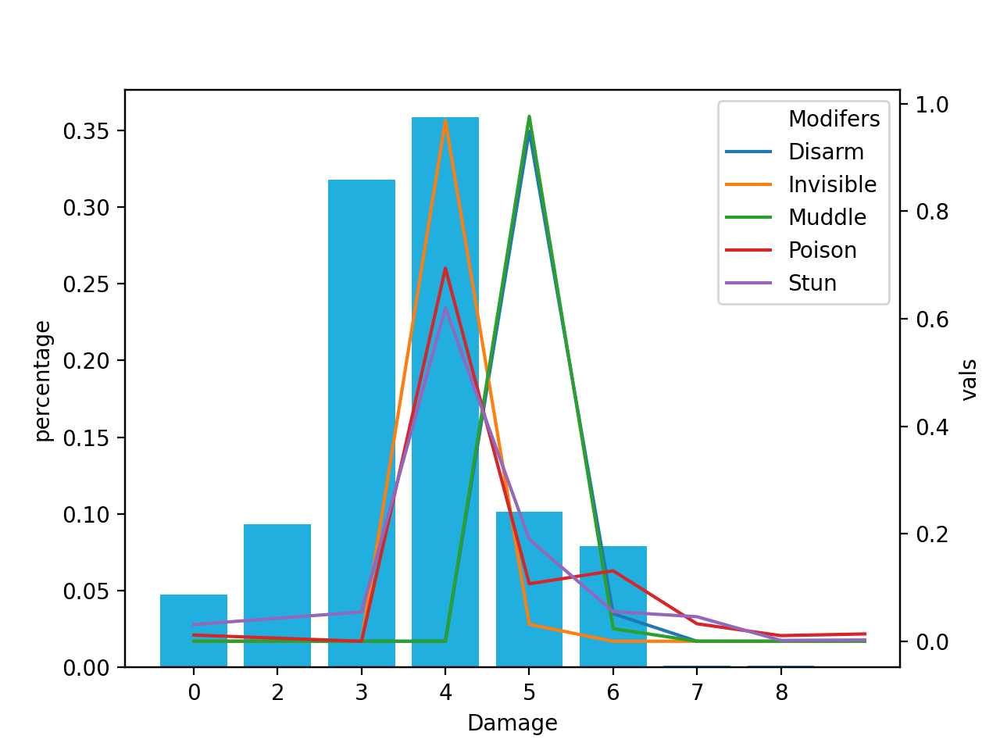
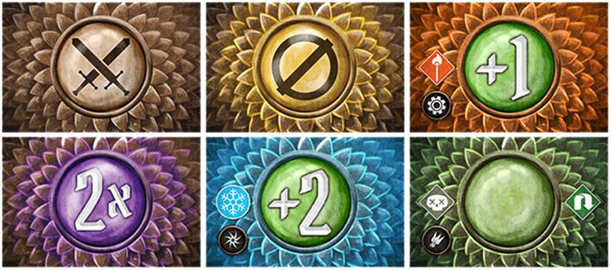

# Gloomhaven Attack Simulator

This Python program simulates 1000 rounds (adjustable) to calculate the probability of each damage, effects average and the average attack damage to allow a user to optimize their deck configuration. The results are then plotted using matplotlib and seaborn.

## Sample Output

```
Gloomhaven Attack Modifier Simulation
Simulating 10000 turns...done.

Damage: 0 Probability: 4.73%
Damage: 2 Probability: 9.33%
Damage: 3 Probability: 31.79%
Damage: 4 Probability: 35.83%
Damage: 5 Probability: 10.17%
Damage: 6 Probability: 7.92%
Damage: 7 Probability: 0.1%
Damage: 8 Probability: 0.13%

Average Damage: 3.54

Disarm chance: 3.32%
Invisible chance: 6.37%
Muddle chance: 6.41%
Poison chance: 9.54%
Stun chance: 12.5%
```


## Details of the Game
The board game Gloomhaven is a card-based combat role-playing game (RPG). In the game, when a character attacks a monster, the base damage is modified by a series of draws from the attack modifier deck.Cards in this deck affect the damage of an attack, and may apply additional modifiers like stun, disarm, or muddle. Here are a few of the attack cards in the deck:



Each attack has a base damage. Cards like +1 and 2x simply add to or multiply the current attack damage. For example, if a player were making an attack with a base damage of 3 and they drew the +1 card, then the attack would do a total damage of 4. For the same attack, drawing the 2x card would result in an attack damage of 6.

**Flip cards** when a player draws a card with the flip symbol, they apply the effect of the card and then draw another card. So, for example, if a player is making an attack with a base damage of 3 and the draw the card +1 they would add 1 (resulting in a current damage of 4) and draw again. If the next card is +2, the player would add another 2 points to the damage (current damage = 6) and draw again. If they then drew 2x the damage would be multiplied by two, resulting in a current damage of 12. Since the 2x did not include a flip symbol (), the player is done drawing and the damage for the current attack is 12.

**The Null Card** the card in the center of the top row of the image above is called the Null (∅) card. The effect of drawing this card is that the total damage for the current attack is becomes zero. No further cards are drawn.

**Other effects** some cards have other effects on the player or the enemy being attacked. A card may poison or stun the players target, turn the player invisible, or release fire on the battlefield. While these effects don't modify the current attack damage, well keep track of them and how often they occur in our simulation. These special effects may occur on their own (e.g. a card like: Stun) or as a part of another modifier (e.g.+1 Fire).

## Run in GitPod
You can also run Gloomhaven Attack Simulator in Gitpod, a free online dev environment for GitHub:

[](https://gitpod.io/#https://github.com/DavBebawy/School-Project/Gloomhaven-Attack-Simulator)